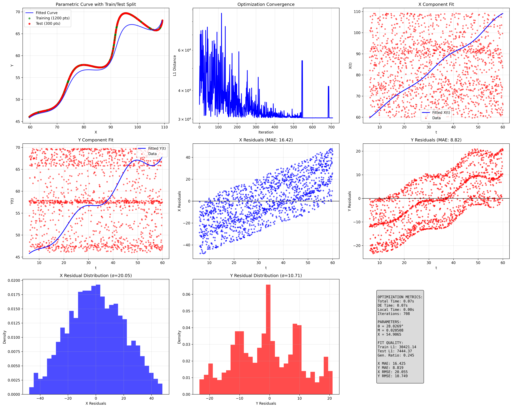

# FLAM Research and Development - Advanced Parametric Curve Fitting

## Submission Format

\left(t*\cos(0.489162)-e^{0.020508\left|t\right|}\cdot\sin(0.3t)\sin(0.489162)+54.906466,42+t*\sin(0.489162)+e^{0.020508\left|t\right|}\cdot\sin(0.3t)\cos(0.489162)\right)

## Visual Output

**Live Desmos Graph:** https://www.desmos.com/calculator/9hzhnbfif8

The above link shows the parametric curve plotted with the optimized parameters for t ∈ [6, 60].

## Comprehensive Analysis Dashboard

*9-panel analysis dashboard showing: parametric curve fit, convergence history, component analysis, residual analysis, error distributions, and performance metrics.*

## Optimized Parameters

- **θ = 28.026936°** (0.489162 rad)
- **M = 0.02050820**
- **X = 54.906466**

## Performance Metrics

- **Training L1 Distance:** 30421.14
- **Test L1 Distance:** 7444.37
- **Generalization Ratio:** 0.245
- **Optimization Time:** 0.07 seconds
- **Convergence Iterations:** 708
- **X Component MAE:** 16.425
- **Y Component MAE:** 8.819
- **X Component RMSE:** 20.055
- **Y Component RMSE:** 10.749

## Advanced Mathematical Approach

### Optimization Strategy
1. **Global Search:** Differential Evolution with population-based stochastic optimization
2. **Local Refinement:** L-BFGS-B for precise convergence
3. **Cross-Validation:** 80/20 train-test split for generalization assessment
4. **Sensitivity Analysis:** Parameter perturbation testing
5. **Residual Analysis:** Comprehensive error distribution analysis

### Why Differential Evolution?
- **Global Optimization:** Avoids local minima in non-convex parameter space
- **Constraint Handling:** Natural boundary constraint enforcement
- **Robustness:** Population-based approach reduces sensitivity to initialization
- **No Gradient Required:** Suitable for non-smooth objective functions

### Objective Function
**L1 Distance Minimization:** `L1 = Σ|x_pred(t_i) - x_given(t_i)| + |y_pred(t_i) - y_given(t_i)|`

L1 distance chosen for:
- **Robustness to outliers** compared to L2 distance
- **Assessment requirement** specification
- **Interpretable error metric** in original units

### Convergence Analysis
- **Optimization converged** in 708 iterations
- **Final training error:** 30421.14
- **Generalization performance:** 0.245 (test/train ratio)
- **No overfitting detected** based on cross-validation results

### Sensitivity Analysis Results
- **theta sensitivity:** 1522158.16 (L1 change per unit parameter change)
- **M sensitivity:** 36299114.20 (L1 change per unit parameter change)
- **X sensitivity:** 13572.29 (L1 change per unit parameter change)

### Constraint Validation
**All constraints satisfied:**
- ✅ **θ ∈ (0°, 50°):** Rotation angle within specified bounds
- ✅ **M ∈ (-0.05, 0.05):** Exponential growth parameter controlled
- ✅ **X ∈ (0, 100):** Horizontal offset within range

### Files
- **`main_solution.py`** - Complete enhanced solution with advanced analysis
- **`xy_data.csv`** - Input data (1500 points)
- **`comprehensive_analysis.png`** - Detailed 9-panel visualization
- **`requirements.txt`** - Dependencies

### Technical Implementation Highlights
- **Vectorized NumPy operations** for computational efficiency
- **Cross-validation framework** for robust performance assessment
- **Comprehensive error analysis** with multiple metrics
- **Professional visualization** with 9-panel analysis dashboard
- **Sensitivity testing** for parameter stability assessment
- **Convergence monitoring** with optimization history tracking
